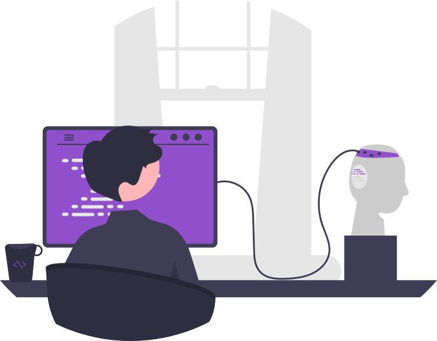

<h2><b>Languages</b></h2>

<h2> <b>Tools</b></h2>

<h2> <b>OS</b></h2>

<h2> <b>Editor</b></h2>

 

    

 

<b>I'm Kaggle enthusiast. Check my profile here: <a href="https://www.kaggle.com/mateuszk013" style="color: #9150CB">kaggle.com/mateuszk013</a></b>
